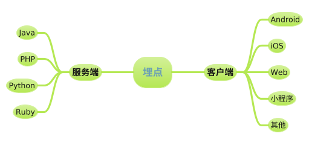
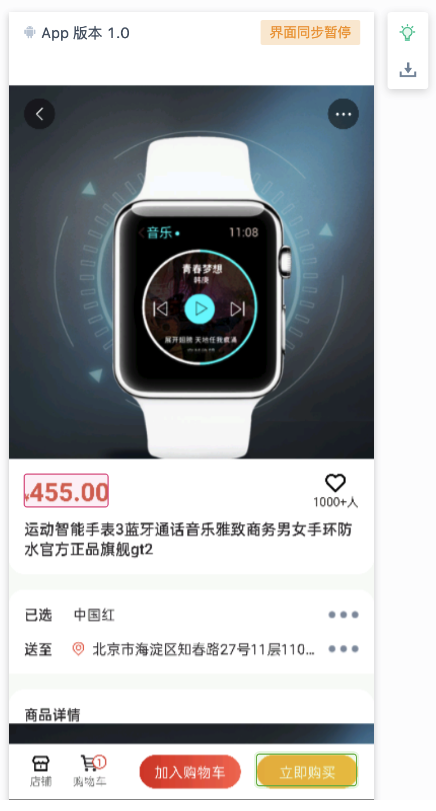
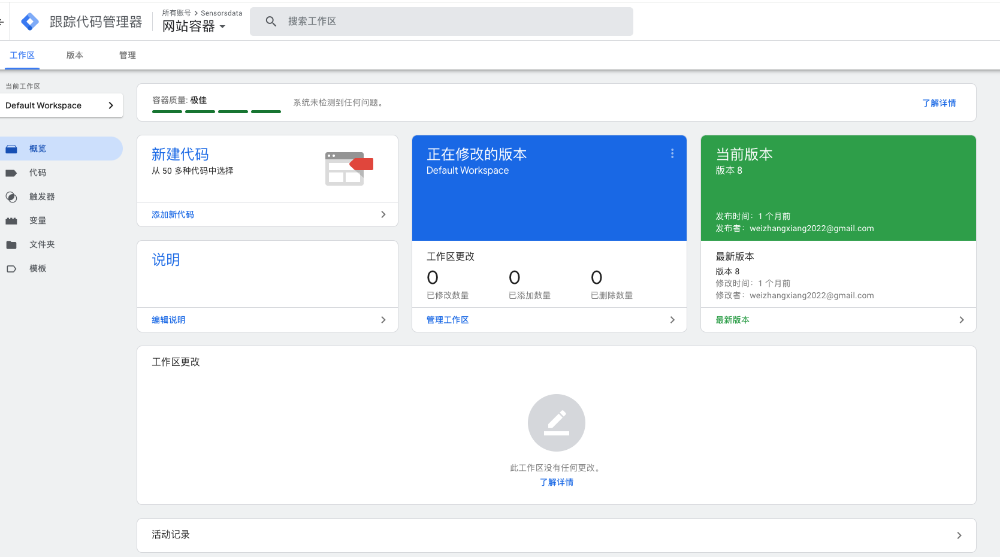

在大数据领域，数据源有多种途径，如服务端、数据仓库、客户端等。客户端包含 Android、iOS、网页、小程序，以及 Flutter、React Native、uni-app 等第三方框架或平台。对于客户端应用和网页而言，**埋点**是大数据分析系统中不可或缺的组成部分。

## 什么是埋点？

自 2010 年起，国内涌现出一批专注于用户行为分析和自动化运营的大数据服务商，如神策数据、GrowingIO、易观、火山引擎等。在为银行、证券、零售、企业等多个行业提供服务的过程中，我们意识到一个基础且关键的点：**数据根基的重要性**。

常见的问题有：*为什么我的数据丢失了？为什么不同平台的数据量存在巨大差异？* 这些问题时常发生。因此，我们必须达成共识：数据的稳固性对整个系统至关重要。

### 数据质量的重要性

如果数据质量出现问题，后续的分析和运营几乎无从谈起。即使生成了一份看似完美的报表和结论，其背后的真实性依然存疑。

## 常见的埋点类型

### 1. 代码埋点

**代码埋点**，顾名思义，就是通过代码实现数据上报的方式。它的优点是灵活性高，可以根据业务需求采集更具针对性的数据，提升数据分析的精确度。

但它的缺点同样明显：代码埋点需要随 App 版本发布才能生效，周期较长，开发成本较高。随着时间推移，滚动增加的埋点可能导致质量和效率的下降。

### 2. 可视化埋点

**可视化埋点**，即通过直观的界面操作，用户可以通过点击、选择等方式轻松完成埋点操作。这种方式降低了技术门槛，使得没有开发背景的人员也能独立完成埋点工作。

这种方式虽然提高了便捷性，但也存在埋点碎片化的问题，尤其是在 App 或网页频繁更新时。比如，今天设置的埋点有效，可能几个月后就失效了。此外，不同平台（如 Android、iOS、Web）仍需分别配置，增加了工作量。

可视化埋点和代码埋点相辅相成，适用于不同的业务场景。例如，在 App 内嵌的 H5 活动页面上，运营人员可以通过可视化埋点轻松满足需求。

### 3. 无埋点

**无埋点**，也被称为全埋点，是通过集成 SDK 的方式，自动采集用户行为数据，如页面浏览、停留、点击、离开等用户操作信息。这种方式的最大优势是显著降低了开发成本，便于快速采集基础的用户行为数据。

然而，无埋点的局限性在于只能采集标准的用户交互数据，无法捕捉具体的业务信息。例如，用户购买了哪件商品、商品的价格等细节数据是无法自动获取的。

### 4. Tag Manager

**Tag Manager**（标签管理器）在国外较为流行，典型代表是 Google Tag Manager。它不仅仅用于埋点，还可用于管理网站或 App 上的各种追踪代码。

Tag Manager 结合了代码埋点和可视化埋点的优点，尤其适合 Web 场景。由于 JavaScript 的灵活性，Tag Manager 可以根据设定的规则动态下发代码，避免了每次更新代码都需重新发布的问题，埋点也能实时生效。然而，对于移动端，它的应用场景则相对有限。

未来，国内或许也会诞生类似 Google Tag Manager 的工具。

## 总结

无论采用哪种埋点方式，都需要结合实际的业务场景进行选择。如果是偏业务类的信息，服务端埋点更为合适；而偏向应用交互的信息，则适合在客户端埋点。对于开发资源紧张的团队，可以选择无埋点或可视化埋点；若追求数据的全面性和灵活性，则代码埋点是不二之选。

归根结底，埋点的核心是围绕业务指标服务，而不是追求面面俱到。**合适的才是最好的**。
